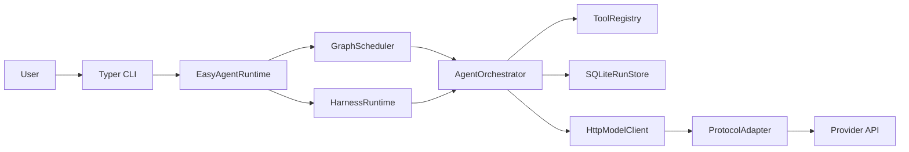

<p align="center">
  
</p>

<h1 align="center">easy-agent</h1>

<p align="center">
  A white-box Python foundation for inspectable, testable, and extensible agent runtimes.
</p>

<p align="center">
  <a href="./README.md">English</a> |
  <a href="./README.zh-CN.md">简体中文</a>
</p>

<p align="center">
  
  
  
  
</p>

`easy-agent` is the runtime layer underneath an agent product, not the product itself. It keeps orchestration, tool calling, persistence, approvals, federation, and evaluation explicit so teams can evolve their systems without hiding critical behavior behind opaque framework abstractions.

The latest published patch is `0.3.5`.

## What This Project Is

Most agent projects move quickly from "call a model" to "ship an application". The runtime layer in the middle then accumulates hidden assumptions around tools, memory, approvals, transport, and recovery.

`easy-agent` exists to keep that middle layer explicit:

- It separates runtime engineering from product logic.
- It keeps scheduling, orchestration, and protocol adaptation inspectable.
- It lets you mount tools, skills, MCP servers, and plugins without rewriting the core.
- It provides durable harnesses, checkpoints, and replay instead of relying on one oversized prompt.

## Who It Is For

- Engineering teams building agent products that need a reusable runtime instead of a one-off demo.
- Developers who want direct control over tool calling, approvals, persistence, and resume behavior.
- Projects that need to evolve with provider APIs, MCP, and multi-agent patterns over time.

## Tech Stack

- Runtime: Python `3.12`, `uv`, `AnyIO`, `Typer`
- Model surface: OpenAI-compatible, Anthropic-style, and Gemini-style payload adaptation
- Persistence: SQLite + JSONL traces
- Integration surface: direct tools, command skills, Python hook skills, MCP, plugins
- Isolation surface: process, container, and microVM workbench executors

## Features

- White-box runtime layers for scheduler, orchestrator, tool registry, storage, and protocol adapters.
- Support for `single_agent`, `sub_agent`, graph workflows, `Agent Teams`, and long-running harnesses.
- Session memory, checkpoints, replay, branchable resume, and approval-aware recovery.
- Guardrails, schema-aware tool validation, runtime event streaming, and persistent traces.
- A2A-style remote federation with durable task state and signed callback verification.
- Public evaluation helpers for benchmark, BFCL, tau2 mock, live provider-compatibility matrices, and real-network regression tracking.

## Human Loop, Replay, and MCP

`easy-agent` already ships the reliability controls that many projects leave as future work:

- Sensitive tools, swarm handoffs, and resumptions can enter a durable approval flow.
- Runs expose safe-point interrupts, checkpoint listing, replay, and forked resume.
- MCP integrations support explicit roots, root snapshots, `notifications/roots/list_changed`, resources or prompts catalog management, durable resource subscriptions, resource-template snapshots, prompt-detail invalidation, elicitation approval state, `streamable_http`, and persisted OAuth state.

Reference:
- Detailed usage: [reference/en/usage-guide.md](./reference/en/usage-guide.md)
- Detailed reinforcement plan: [reference/en/next-reinforcement.md](./reference/en/next-reinforcement.md)

## A2A Remote Agent Federation

The federation layer publishes local agents, teams, and harnesses through a durable A2A-style surface:

- Well-known discovery, richer cards, push or poll delivery, retry, and resubscribe flows.
- OAuth/OIDC token acquisition and refresh for remote federation clients.
- JWKS/JWS validation for signed cards and signed callbacks.
- Stricter tenant/task authorization boundaries before federated state is revealed or mutated.

Operational detail and comparison notes are documented in [reference/en/test-results.md](./reference/en/test-results.md).

## Executor / Workbench Isolation

The executor/workbench layer gives long-lived tools and MCP subprocesses a reusable runtime boundary:

- Named executors for `process`, `container`, and `microvm`.
- Persistent workbench sessions, manifests, snapshots, and TTL cleanup.
- Real-network regression coverage for warm-start latency and snapshot drift.

Detailed operational notes are documented in [reference/en/usage-guide.md](./reference/en/usage-guide.md).

## Architecture

The runtime is intentionally modular and observable:

- `scheduler` coordinates direct-agent and graph execution.
- `orchestrator` runs agent and team turns.
- `harness` manages initializer, worker, and evaluator loops.
- `registry` exposes tools, skills, MCP tools, and mounted plugins.
- `storage` persists runs, checkpoints, approvals, sessions, federation state, and workbench state.



## Long-Running Harness Design

Harnesses are first-class runtime objects rather than prompt conventions. Each harness defines:

- an `initializer_agent`
- a `worker_target`
- an `evaluator_agent`
- an explicit `completion_contract`

The worker loop persists artifacts and checkpoints so long-running tasks can continue, replan, or resume without discarding state.

## Protocol and Tool Model

- Model protocols: OpenAI-compatible chat-completions or Responses API payload normalization, Anthropic-style payloads, and Gemini-style payload normalization.
- Tool calling: strict schema transport, nullable/optional modeling, validation-repair loops, provider-neutral tool-choice controls, and explicit enforced-versus-best-effort provider compatibility telemetry.
- Web-search eval hardening: SerpApi `/search.json`, grounded source ledgers, cache-first contents reuse, replay-backed contents fallback, raw official BFCL manifest normalization, and single-call regression guards.

Provider behavior details and structured-output notes live in [reference/en/next-reinforcement.md](./reference/en/next-reinforcement.md).

## Project Layout

```text
src/
  agent_cli/
  agent_common/
  agent_config/
  agent_graph/
  agent_integrations/
  agent_protocols/
  agent_runtime/
skills/
configs/
tests/
reference/
  en/
  zh/
```

## Quick Start

```bash
uv venv --python 3.12
uv sync --dev
uv run easy-agent --help
uv run easy-agent doctor -c easy-agent.yml
```

Detailed setup, local credentials, CLI commands, and examples:
- [reference/en/usage-guide.md](./reference/en/usage-guide.md)

## What a Harness Run Produces

A harness run persists durable artifacts under the configured artifact directory and durable session storage, including:

- bootstrap and progress markdown
- feature snapshots
- checkpoints and replay state
- workbench session metadata

Artifact details are documented in [reference/en/usage-guide.md](./reference/en/usage-guide.md).

## Verification

The latest published patch remains `0.3.5`. The retained benchmark and headline public-eval score snapshot is still the April 14, 2026 release baseline, while the latest Python verification refresh on April 20, 2026 revalidated the live provider-compatibility matrix and real-network suite without changing that retained score baseline. Methodology notes, public comparison rows, and detailed matrices live in [reference/en/test-results.md](./reference/en/test-results.md).

### Score Summary

| Test Set | Score |
| --- | ---: |
| benchmark.overall | 100.0 |
| public_eval.bfcl_overall | 100.0 |
| public_eval.tau2_mock | 100.0 |

## Real Network Test Set Results

The real-network matrix is reported as score-only in this README. The score row below was revalidated on April 20, 2026, while durations, telemetry, warm-start budgets, and snapshot-drift detail are tracked in [reference/en/test-results.md](./reference/en/test-results.md).

| Test Set | Score |
| --- | ---: |
| real_network.overall | 100.0 |

## Next Reinforcement

The next reinforcement track is documented in full at [reference/en/next-reinforcement.md](./reference/en/next-reinforcement.md). The near-term focus remains:

- widening the shipped live provider-compatibility matrix beyond the required DeepSeek/OpenAI-compatible baseline, including optional Anthropic and Gemini evidence when credentials are present
- extending BFCL web-search from grounded replay safety toward richer source-ledger, source-aware, and multihop official coverage
- expanding live `/responses` compatibility coverage where OpenAI-compatible providers actually expose it, while keeping single-tool enforcement explicitly labeled as best effort when providers do not honor it strictly
- deepening MCP notification parity around resource updates, prompt-detail refresh, and template diff telemetry

## Design References

- OpenAI function calling: <https://developers.openai.com/api/docs/guides/function-calling>
- OpenAI structured outputs: <https://developers.openai.com/api/docs/guides/structured-outputs>
- OpenAI web search tool: <https://platform.openai.com/docs/guides/tools-web-search>
- Anthropic tool use: <https://platform.claude.com/docs/en/agents-and-tools/tool-use/define-tools>
- Gemini function calling: <https://ai.google.dev/gemini-api/docs/function-calling>
- BFCL v4 web search: <https://gorilla.cs.berkeley.edu/blogs/15_bfcl_v4_web_search.html>
- Model Context Protocol: <https://modelcontextprotocol.io/specification>
- SerpApi Search API: <https://serpapi.com/search-api>
- FastAPI README style reference: <https://github.com/fastapi/fastapi>
- uv README style reference: <https://github.com/astral-sh/uv>

## Acknowledgements

- [Linux.do](https://linux.do/) for community discussion and open knowledge sharing.
- [](https://www.deepseek.com/) for the real verification baseline and model endpoint.

## License

MIT. See [LICENSE](./LICENSE).
