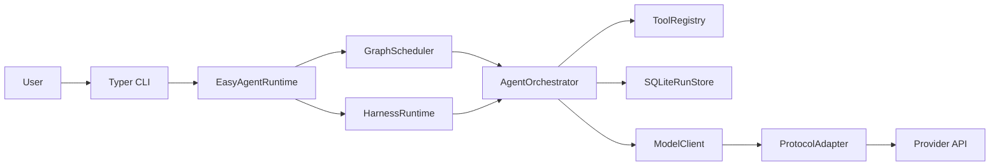

<p align="center">
  
</p>

<h1 align="center">easy-agent</h1>

<p align="center">
  一个可检查、可测试、可扩展的白盒 Python Agent 运行时底座。
</p>

<p align="center">
  <a href="./README.md">English</a> |
  <a href="./README.zh-CN.md">简体中文</a>
</p>

<p align="center">
  
  
  
  
</p>

`easy-agent` 面向的是 Agent 产品下面的那层运行时基础设施，而不是具体业务应用本身。它把编排、工具调用、持久化、人审、联邦与评测能力显式保留在框架里，方便团队持续演进而不是被黑盒抽象锁死。

当前已发布的小版本是 `0.3.5`。

## 这个项目到底是什么

很多 Agent 项目会很快从“调用模型”走到“交付应用”。中间的运行时层随后会堆积大量隐式假设，例如工具调用约束、记忆、审批、传输和恢复流程。

`easy-agent` 的目标就是把这层中间件做成显式能力：

- 把运行时工程与业务逻辑分离。
- 让调度、编排、协议适配保持可检查。
- 让 tools、skills、MCP servers、plugins 可以持续挂载，而不是反复重写核心。
- 用真实的 harness、checkpoint 与 replay 取代一个越来越大的 prompt。

## 适合谁用

- 需要一套可复用运行时而不是一次性 demo 的 Agent 工程团队。
- 希望直接掌控工具调用、审批、持久化和恢复流程的开发者。
- 需要随着模型 API、MCP 和多 Agent 模式持续演进的项目。

## 技术栈

- Runtime：Python `3.12`、`uv`、`AnyIO`、`Typer`
- Model Surface：OpenAI-compatible、Anthropic-style、Gemini-style 载荷适配
- Persistence：SQLite + JSONL traces
- Integration Surface：direct tools、command skills、Python hook skills、MCP、plugins
- Isolation Surface：process、container、microVM workbench executors

## 能力一览

- 白盒运行时分层，明确暴露 scheduler、orchestrator、tool registry、storage 和 protocol adapters。
- 同时支持 `single_agent`、`sub_agent`、graph workflows、`Agent Teams` 与长任务 harness。
- 提供 session memory、checkpoints、replay、branchable resume 与审批感知恢复。
- 内置 guardrails、schema-aware tool validation、runtime event streaming 与 traces。
- 提供 durable run inspection 与 structured trace-tree export，方便排查复杂 agent flows。
- 新增离线 `mock` provider 以及 `setup`、`wizard`、`init`、`quickstart`、场景模板、connector diagnostics、task packs、workflow packs、`workflow init/run workflow.yml`、`config doctor`、`runs explain`、advice-only `runs triage` / `runs fix` / `runs bundle`、`traces open`、`report latest`、`report trend`、单文件 HTML trace/report/fix/dashboard export、dashboard workflow/template recommendations 和轻量 Python `AgentApp` facade，可以零凭据完成上手、配置理解和失败归因。
- 通过 `browser.enabled: true` 提供 MCP-first browser automation：运行时会把 Playwright MCP 挂成 stdio MCP server，默认对敏感浏览器操作加审批保护，并提供 browser doctor 与 artifact inspection 命令。
- 提供 A2A 风格远程联邦、持久化联邦任务状态以及签名 callback 校验。
- 提供更实用的 `official_source_search` skill，可做官方源优先搜索与页面内容抓取。
- 提供 benchmark、BFCL、tau2 mock、BrowseComp/SimpleQA 风格切片、live provider compatibility matrix 与 real-network 回归能力。

## Human Loop、Replay 与 MCP

`easy-agent` 已经把很多项目还停留在 roadmap 的可靠性能力做成了已实现特性：

- 敏感工具、swarm handoff 与 resume 可以进入同一套 durable approval 流程。
- 运行支持 safe-point interrupt、checkpoint list、replay 与 forked resume。
- MCP 已支持显式 roots、root snapshot、`notifications/roots/list_changed`、resources/prompts catalog 管理、durable resource subscription、resource template snapshots、prompt detail 失效标记、elicitation 审批状态、`streamable_http` 与持久化 OAuth state。

参考文档：
- 详细使用说明：[reference/zh/usage-guide.md](./reference/zh/usage-guide.md)
- 详细补强路线：[reference/zh/next-reinforcement.md](./reference/zh/next-reinforcement.md)

## A2A Remote Agent Federation

联邦层可以把本地 agents、teams、harnesses 通过耐用的 A2A 风格接口公开出去：

- 支持 well-known discovery、丰富 card、push/poll 投递、retry 与 resubscribe。
- 支持远端 federation client 的 OAuth/OIDC token 获取与刷新。
- 支持 signed card 与 signed callback 的 JWKS/JWS 校验。
- 在暴露或修改联邦状态之前，先执行更严格的 tenant/task 授权边界检查。

运行细节与同类项目对比详见 [reference/zh/test-results.md](./reference/zh/test-results.md)。

## Executor / Workbench Isolation

executor/workbench 层给长生命周期工具和 MCP 子进程提供了可复用的运行边界：

- 统一命名 executor：`process`、`container`、`microvm`
- 持久化 workbench sessions、manifests、snapshots 与 TTL cleanup
- 输出 capability report，覆盖 filesystem boundary、network policy、env handling、process shutdown 与 snapshot restore behavior
- 针对 warm-start latency 与 snapshot drift 提供 real-network 回归覆盖

详细操作说明见 [reference/zh/usage-guide.md](./reference/zh/usage-guide.md)。

## 架构说明

这个运行时是刻意模块化、可观测的：

- `scheduler` 负责 direct-agent 与 graph 执行
- `orchestrator` 负责 agent 和 team turn
- `harness` 负责 initializer、worker、evaluator 循环
- `registry` 负责 tools、skills、MCP tools、plugins
- `storage` 负责 runs、checkpoints、approvals、sessions、federation state、workbench state



## 长任务 Harness 设计

Harness 不是 prompt 约定，而是运行时的一等公民。每个 harness 会显式定义：

- `initializer_agent`
- `worker_target`
- `evaluator_agent`
- `completion_contract`

worker 循环会把 artifacts 与 checkpoints 持久化下来，因此长任务可以继续、replan 或 resume，而不会丢失状态。

## 协议与工具模型

- 模型协议：OpenAI-compatible 的 chat-completions / Responses API 双路径归一化、Anthropic-style、Gemini-style 载荷归一化
- 工具调用：strict schema transport、nullable/optional 参数建模、validation-repair loops、provider-neutral tool-choice controls，以及显式区分 enforced / best-effort 的 provider compatibility telemetry
- 搜索与评测补强：SerpApi `/search.json`、preferred official domains 的 source-policy 排序、grounded source ledger、cache-first contents reuse、replay-backed contents fallback、raw official BFCL manifest 归一化，以及 `browsecomp_subset` / `simpleqa_subset` / `simple_evals_subset` profile 支持

Provider 行为细节与 structured outputs 约束说明见 [reference/zh/next-reinforcement.md](./reference/zh/next-reinforcement.md)。

## 项目结构

```text
src/
  agent_cli/
  agent_common/
  agent_config/
  agent_graph/
  agent_integrations/
  agent_protocols/
  agent_runtime/
skills/
configs/
tests/
reference/
  en/
  zh/
```

## 快速开始

```bash
uv venv --python 3.12
uv sync --dev
uv run easy-agent setup --provider mock
uv run easy-agent wizard --scenario coding-agent --target-dir my-agent --provider mock
uv run easy-agent config explain -c easy-agent.yml
uv run easy-agent config doctor -c easy-agent.yml
uv run easy-agent quickstart --provider mock
uv run easy-agent new coding-agent
uv run easy-agent new data-agent
uv run easy-agent new ops-agent
uv run easy-agent new browser-agent
uv run easy-agent new web-monitor-agent
uv run easy-agent new seo-agent
uv run easy-agent new competitor-research-agent
uv run easy-agent new meeting-notes-agent
uv run easy-agent new content-pipeline-agent
uv run easy-agent new customer-support-agent
uv run easy-agent connectors doctor -c easy-agent.yml
uv run easy-agent workflow list
uv run easy-agent workflow init browser-audit --output workflow.yml --context "Audit the home page"
uv run easy-agent workflow run workflow.yml -c easy-agent.yml --dry-run
uv run easy-agent workflow run browser-qa -c easy-agent.yml --dry-run --context "Check the home page"
uv run easy-agent task show repo-review
uv run easy-agent task show browser-qa
uv run easy-agent browser doctor -c easy-agent.yml
uv run easy-agent browser smoke https://example.com -c easy-agent.yml
uv run easy-agent browser snapshot https://example.com -c easy-agent.yml
uv run easy-agent browser audit https://example.com -c easy-agent.yml
uv run easy-agent browser artifacts -c easy-agent.yml
uv run easy-agent runs triage <run_id> -c easy-agent.yml
uv run easy-agent runs bundle <run_id> -c easy-agent.yml --output run-bundle
uv run easy-agent report latest -c easy-agent.yml
uv run easy-agent report latest -c easy-agent.yml --html --output report.html
uv run easy-agent report trend --history reports --html --output trend.html
uv run easy-agent dashboard -c easy-agent.yml --output dashboard.html
uv run easy-agent init --provider mock
uv run easy-agent --help
uv run easy-agent doctor -c easy-agent.yml
```

详细环境准备、本地凭据、CLI 示例与运行方式：
- [reference/zh/usage-guide.md](./reference/zh/usage-guide.md)

## 一次 Harness 运行会留下什么

一次 harness 运行会把以下工件持久化到配置的 artifact 目录与 durable session storage：

- bootstrap / progress markdown
- feature snapshots
- checkpoints 与 replay state
- workbench session metadata

详细说明见 [reference/zh/usage-guide.md](./reference/zh/usage-guide.md)。

## 验证方式

当前已发布的小版本仍然是 `0.3.5`。README 里保留的 benchmark 与 public-eval headline 分数仍以 2026 年 4 月 14 日发布快照为基线，而 2026 年 4 月 30 日这轮最新的 Python 验证重新跑通了 `ruff`、`mypy`、`231` 个 unit tests 和 `7` 个 live integration tests，但没有改写这组保留分数基线。方法说明、公开对比与详细矩阵见 [reference/zh/test-results.md](./reference/zh/test-results.md)。

### 分数摘要

| 测试集 | 分数 |
| --- | ---: |
| benchmark.overall | 100.0 |
| public_eval.bfcl_overall | 100.0 |
| public_eval.tau2_mock | 100.0 |

## 真实网络测试集结果

README 这里仍然只保留分数摘要，但 real-network 报告现在也会记录场景证明字段：command、expected artifact、pass criteria 和 security assertions。耗时、telemetry、warm-start budget、snapshot drift 与完整场景矩阵都放在 [reference/zh/test-results.md](./reference/zh/test-results.md)。

| 测试集 | 分数 |
| --- | ---: |
| real_network.overall | 100.0 |

| 场景证明 | 通过标准 |
| --- | --- |
| resume after failure | checkpoint replay 或 resume 完成，并且不重复执行已完成工作 |
| human approval pending then continue | 敏感操作进入 durable approval，并在批准后继续 |
| MCP server restart | catalog 与 subscription state 能跨 transport refresh 或 restart 保留 |
| provider tool schema rejection then repair | provider schema rejection 会进入 strict-schema repair 证据链 |
| federation disconnect and retry | callback retry、signed delivery、subscribe 与 resubscribe 保持耐用 |
| workbench snapshot restore | process、container 或 microVM session 能在预算内恢复状态 |

## 下一步补强

完整补强路线见 [reference/zh/next-reinforcement.md](./reference/zh/next-reinforcement.md)。近期重点仍然是：

- 把已经交付的 structured trace tree、`traces open`、`report latest`、`report trend`、单文件 report HTML 与 experimental `--otel-json` export 作为主要排障入口，同时继续把 native trace tree 作为事实来源
- 继续用 guided setup/wizard preflight、config explanation、connector diagnostics、workflow YAML、browser smoke/snapshot/audit/report helpers、browser doctor/artifact inspection、task packs、静态 dashboard workflow/template recommendations、advice-only triage/fix/bundle packages，以及面向 coding、research、data、ops、browser automation、web monitoring、SEO、competitor research、meeting notes、content pipelines、support、sales、documents、QA、release checks 的业务模板固化零凭据上手层
- 把已交付的 live provider compatibility matrix 从必跑的 DeepSeek/OpenAI-compatible 基线继续扩展到有凭据时的 Anthropic 与 Gemini 证据
- 在拿到官方数据导出与 grader 凭据后，把新的 official-source search + BrowseComp/SimpleQA 路径推进成可刷新分数的评测切片
- 在 OpenAI-compatible provider 真实暴露 `/responses` 时补齐 live 覆盖，并把 single-tool enforcement 无法严格保证的情况继续明确标成 best effort
- 继续深化 MCP notification parity、A2A federation demo 与本地 skill/plugin catalog workflow，同时保持 local/private connectivity、approvals 与 network boundaries 由 runtime 管理

## 设计参考

- OpenAI function calling：<https://developers.openai.com/api/docs/guides/function-calling>
- OpenAI structured outputs：<https://developers.openai.com/api/docs/guides/structured-outputs>
- OpenAI web search tool：<https://developers.openai.com/api/docs/guides/tools-web-search>
- OpenAI Agents SDK 与 tracing：<https://developers.openai.com/api/docs/libraries#install-the-agents-sdk>
- OpenAI simple-evals：<https://github.com/openai/simple-evals>
- Playwright MCP：<https://github.com/microsoft/playwright-mcp>
- Anthropic tool use：<https://platform.claude.com/docs/en/agents-and-tools/tool-use/overview>
- Gemini function calling：<https://ai.google.dev/gemini-api/docs/function-calling>
- BFCL v4 web search：<https://gorilla.cs.berkeley.edu/blogs/15_bfcl_v4_web_search.html>
- Model Context Protocol：<https://modelcontextprotocol.io/specification/2025-11-25>
- Agent2Agent protocol：<https://a2a-protocol.org/latest/specification/>
- OpenTelemetry GenAI semantic conventions：<https://opentelemetry.io/docs/specs/semconv/gen-ai/>
- SerpApi Search API：<https://serpapi.com/search-api>
- FastAPI README 风格参考：<https://github.com/fastapi/fastapi>
- uv README 风格参考：<https://github.com/astral-sh/uv>

## 致谢

- [Linux.do](https://linux.do/) 提供了开放的社区讨论与知识分享环境。
- [](https://www.deepseek.com/) 为本仓库真实验证流程提供了模型端点基线。

## License

MIT。详见 [LICENSE](./LICENSE)。
